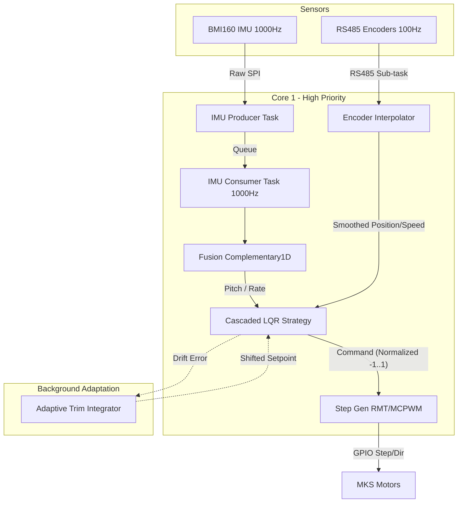

# Tuning Journal - AutoBalancingBot

## System Constants
- **Loop Frequency**: 500Hz (2ms)
- **Encoder Resolution**: 51,200 ticks/rev (Divided by 10 in logic)
- **Hardware**: MKS Servo 42D (RS485), BMI160 (Rigid mount)

---

## Evolution Log

| Version | Kp (Pitch) | Kg (Gyro) | Kd (Dist) | Ks (Speed) | Result | Observation |
| :--- | :--- | :--- | :--- | :--- | :--- | :--- |
| **v40** | 0.08 | 0.02 | 0.0001 | 0.0 | **Unstable** | Soft balance, Adaptive Trim was too fast (0.001), robot "chased" itself. |
| **v41** | 0.12 | 0.02 | 0.0003 | 0.0 | **Runaway** | First use of Scale/10. $K_d$ was 30x too high, saturated terms at 15.0. |
| **v42** | 0.12 | 0.02 | 0.00001 | 0.0 | **Runaway** | Position anchor too soft to stop the drift, but term saturation was fixed. |
| **v43** | 0.10 | 0.04 | 5e-6 | 0.0001 | **Oscillation** | Violent 5.4Hz wobble. $K_s$ (Speed damping) too high for noisy derivatives. |
| **v44** | 0.15 | 0.05 | 1e-5 | 2e-5 | **Oscillation** | Constant hum/wobble. High resolution + loop latency = phase lag issues. |
| **v45** | 0.12 | 0.03 | 0.0 | 0.0 | **Suicide** | **Filter Sign Error**. Robot dove into the floor in 80ms. |
| **v47** | 0.08 | 0.02 | 5e-5 | 0.0 | **Wobbly** | Found physical bias at **13.7°**. Still oscillating (6Hz) and running away. |
| **v48.1** | 0.10 | 0.04 | 0.0001 | 0.0 | **Wobbly** | 1000Hz IMU / 500Hz Balancer. Better, but still 5.4Hz oscillation. |
| **v48.2** | 0.10 | 0.04 | 0.0001 | 0.0 | **Wobbly** | Full 1000Hz Sync. RS485 holds well. Oscillation slowed to 2.2Hz. |
| **v49** | 0.05 | 0.02 | 5e-5 | 0.0 | **Wobbly** | Halved gains to exit saturation. **Bug found**: Adaptive Trim sign was inverted, causing runaway. |
| **v50** | 0.04 | 0.015 | 2e-5 | 0.0 | **Saturated** | Correct sign. 15Hz oscillation (Phase Lag limit). Command hits +/- 1.0. Trim too slow. |
| **v51** | 0.035 | 0.012 | 1e-5 | 0.0 | **Worse** | Fell faster (0.8s). Gains too weak. Trim frozen by 15° safety limit. |
| **v52** | 0.042 | 0.008 | 5e-6 | 0.0 | **Wobbly** | Trim s'emballe pendant la chute (10°). Kg trop bas = manque de tenue. |
| **v53** | 0.045 | 0.012 | 5e-6 | 0.0 | **Worse** | Fall in 0.7s. Trim limited by 7° window. Pre-saturation at 60% due to bias. |
| **v54/55** | 0.050 | 0.015 | 5e-6 | 0.0 | **Runaway** | "Turbo Trim": High alpha/window. Trim ran to -23° in 1.4s, killing balance. |
| **v56** | 0.045 | 0.012 | 0.0 | 0.0 | **Wobbly** | Trim finally stable (~1.5°). Peak 11.3Hz on FFT. Fell in 0.9s. |
| **v57** | 0.045 | 0.018 | 0.0 | 0.0 | **Wobbly** | Dominant peak at 12.5Hz. Damping term (Kg) is too filtered to be effective. |
| **v58** | 0.045 | 0.035 | 0.0 | 0.0 | **Better** | Holds ~2.6s. Trim ~0°. Damping works, but motor command becomes high‑freq “chatter” then falls. |
| **v59** | 0.045 | 0.030 | 0.0 | 0.0 | **Better** | Holds ~3.0s. Trim stays controlled (~-2.3°). Chatter persists; FFT peak (5-30Hz) ~8.8Hz. |
| **v60** | 0.045 | 0.028 | 0.0 | 0.0 | **TBD** | Reduce chatter further: LPF alpha 0.3 -> 0.25 and Kg 0.030 -> 0.028. |

---
# Phase 2: High-Performance Synchronous Loop (1000Hz)

## New System Baseline (v61+)
A major architectural shift was completed to eliminate "System Noise" before tuning control gains.

### Architectural Specs
- **Control Loop**: 1000Hz Synchronous (1ms fixed $\Delta t$) on Core 1.
- **Actuation**: Hardware RMT Step/Dir (Pulse-accurate, zero-latency).
- **Telemetry**: RS485 Dual Bus (256kbps), 48-bit cumulative position.
- **Interpolation**: "Convergent Smoothing" (Nudging) algorithm bridges 200Hz telemetry to 1000Hz loop.
- **IMU Filter**: `COMPLEMENTARY1D` (Zero phase lag, extremely fast).
- **Pitch Rate LPF**: Alpha = 0.15 (approx. 10ms time constant).

### Initial State for Phase 2
The robot is now "Electronically Silent". All previous "poils" (telemetry jumps) and step-jitter have been removed.

| Version | Kp | Kg | Kd | Ks | Result | Observation |
| :--- | :--- | :--- | :--- | :--- | :--- | :--- |
| **v61** | 0.045 | 0.028 | 0.0 | 0.0 | **Baseline** | LPF alpha 0.15. Baseline de survie ~2.2s. |
| **v62** | 0.060 | 0.040 | 0.0 | 0.0 | **Vibrant** | Survie ~2.7s. Pic FFT à 22Hz. Meilleure tenue mais sature encore. |
| **v63** | 0.080 | 0.045 | 0.0 | 0.0 | **Instable** | Survie 1.8s. Vibration 23Hz trop forte. Sature violemment et tombe. |
| **v64** | 0.030 | 0.015 | 0.0 | 0.0 | **Sain (Moteur)** | Survie 2.3s. Pic FFT à 5.22Hz. Pas de saturation carrée. |
| **v65** | 0.040 | 0.018 | 0.0 | 0.0 | **Prometteur** | Survie 2.4s. Alpha=0.25. Oscillation propre ~6Hz. |
| **v66** | 0.055 | 0.025 | 0.0 | 0.0 | **Vibrant** | Survie 2.7s. **Buzz à 27.4Hz** (FFT). Gains trop hauts pour le filtrage actuel. |
| **v67** | 0.048 | 0.022 | 0.0 | 0.0 | **Sain** | Bonne oscillation (5.1Hz). Dérive car pas de Kd/Ks. Tombe "des deux côtés". |
| v68 | 0.048 | 0.022 | 2e-5 | 5e-6 | **Drift** | Activation Kd/Ks et Trim Adaptatif (Alpha=0.0001) pour stabiliser la position. Trim correct (+7.0) mais trop lent vers 13.7. |
| v69 | 0.050 | 0.022 | 1e-5 | 2e-6 | **Unstable** | Turbo Trim overshot (reached 21°). Kp=0.05 caused 10Hz resonance. Fell in 0.3s. |
| v70 | 0.045 | 0.025 | 1.5e-5 | 2e-6 | **TBD** | **Stability Patch & IRAM Fix**. Moved compute path to IRAM to fix NVS crash. Slowed alpha to 2e-4. Kp=0.045, Kg=0.025 to kill buzz. |
| v71 | 0.050 | 0.035 | 5e-5 | 0.0 | **Sign Fix** | First sign correction. Position anchor ($K_d$) still too weak to stop drift. |
| v72 | 0.050 | 0.035 | 5e-5 | 5e-6 | **Trim Fix** | Fixed Adaptive Trim sign error. Increased $K_s$. Trim was too fast (runaway). |
| **v73** | 0.060 | 0.045 | 0.0001 | 5e-6 | **Chatter** | 5.4Hz oscillation. Command saturated in a solid block. Trim stable at -1.7°. |
| **v74** | 0.045 | 0.035 | 0.0001 | 2e-5 | **Oscillation** | 6.08Hz oscillation. Command LPF 30Hz added too much lag. Actuation was throttled at 125Hz! |
| **v75** | 0.050 | 0.030 | 1.5e-4 | 5e-5 | **Oscillation** | 13.45Hz vibration. Motors updated at 1000Hz (RMT jitter). Command was 0 in capture (not enabled). |
| **v76** | 0.050 | 0.025 | 1.0e-4 | 1e-5 | **Current** | **Permissive Start**. Auto-enable at 10°. Motor update 400Hz. Reduced Kg/Kd/Ks to favor recovery. |

---
## Technical Analysis: Data Flow & Latency (v76 Logic)
The following Mermaid diagram explains the synchronous loop used to drive the LQR controller.

## Observations v75
1. **The 13Hz Barrier**: 13.45Hz is the phase lag limit. Every bit of filtering (LPF) or latency (Divider) pushes this peak lower. 
2. **Auto-Enable Trap**: If starting > 2°, the motors don't enable, leading to a "dead" robot.
3. **RMT Saturation**: Updating RMT frequency at 1000Hz while clk_div is 160 leads to resolution steps and peripheral stalls.

---
## Technical Analysis: The 12-14Hz Mystery (Resolved)
The 12-14Hz (approx 70-80ms period) is the **Phase Lag limit** of the system.
- **FFT Proof**: v55 clearly shows a dominant peak at **12.5Hz**.
- **System Latency**: By switching to `COMPLEMENTARY1D`, we eliminate the filter lag. In v45, the filter was fighting itself; v46 fixes the gyro sign.

## Action Plan (Convergence Strategy)
To stop "shooting in the dark", we follow this sequence:

1. **Step 1: Pure Balance (Alpha stage - current V56)**
   - Target: Robot balances without vibrating, even if it moves forward/backward.
   - Using: `IMU_FILTER_COMPLEMENTARY` for zero-lag response.
   - **Trim Status**: Set near-zero to prevent interference.
   
2. **Step 2: Static COG Correction**
   - Once Step 1 is stable, find the **fixed** `pitch_offset` that stops the drift. 
   - *Do not use Adaptive Trim yet.*

3. **Step 3: Add Damping ($K_s$)**
   - Slowly add $K_s$ to resist forward movement (Viscous friction).

4. **Step 4: Enable Position Anchor ($K_d$) & Trim**
   - Last step to lock the robot to a single tile.
