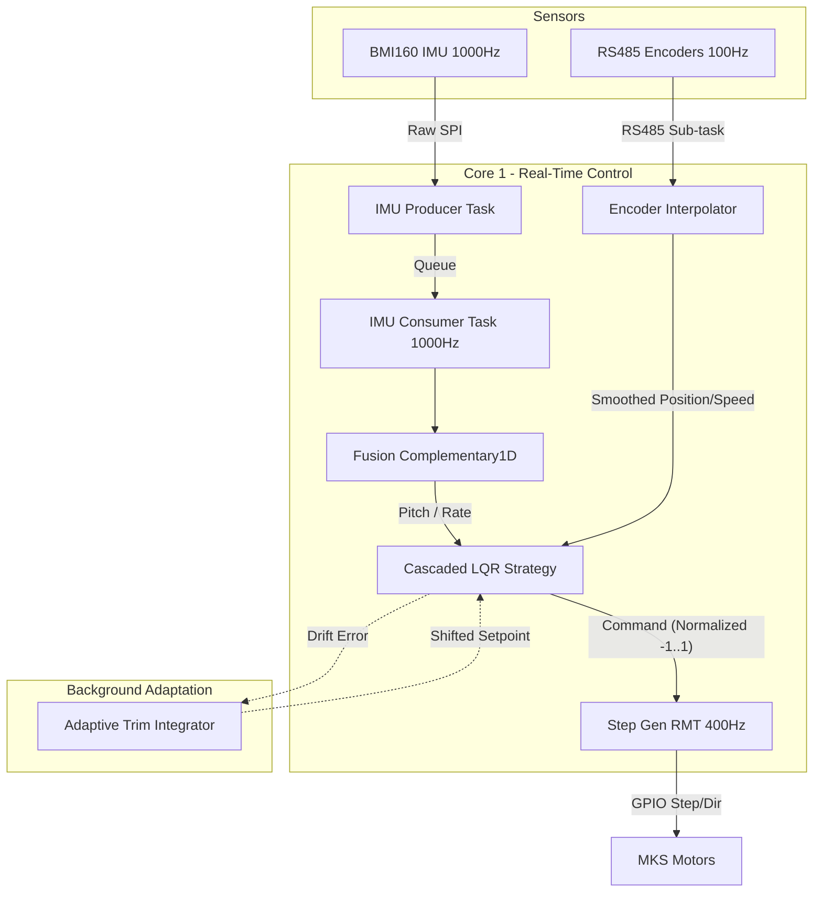

# Data Flow & Control Architecture

This document describes the high-represenation synchronous control loop used by the AutoBalancingBot.

## Control Loop Architecture

The system uses a dual-core approach on the ESP32-S3:
- **Core 1 (High Priority)**: Processes IMU data, sensor fusion, and the LQR control law at a strict 1000Hz.
- **Core 0 (System)**: Handles Wi-Fi, Bluetooth (NimBLE), and low-priority background tasks.

## Data Path Details

1. **IMU Path**: Raw data is read via SPI at 1kHz. The `Producer` task pushes samples to a queue for the `Consumer`.
2. **Fusion Path**: `Complementary1D` filter computes pitch and pitch-rate with zero phase lag.
3. **Odometry Path**: Encoders are read via RS485 at 100Hz on independent buses. A 1st-order hold `Interpolator` upsamples this to 1000Hz for the LQR.
4. **Control Path**: The `CascadedLqrStrategy` computes the sum of four states:
   - `Kp * angle_error`
   - `Kg * pitch_rate`
   - `Kd * position_error`
   - `Ks * velocity_error`
5. **Actuation Path**: The normalized command is converted to a pulse frequency and sent to the `RMT` (Remote Control) peripheral to generate hardware Step/Dir signals.
