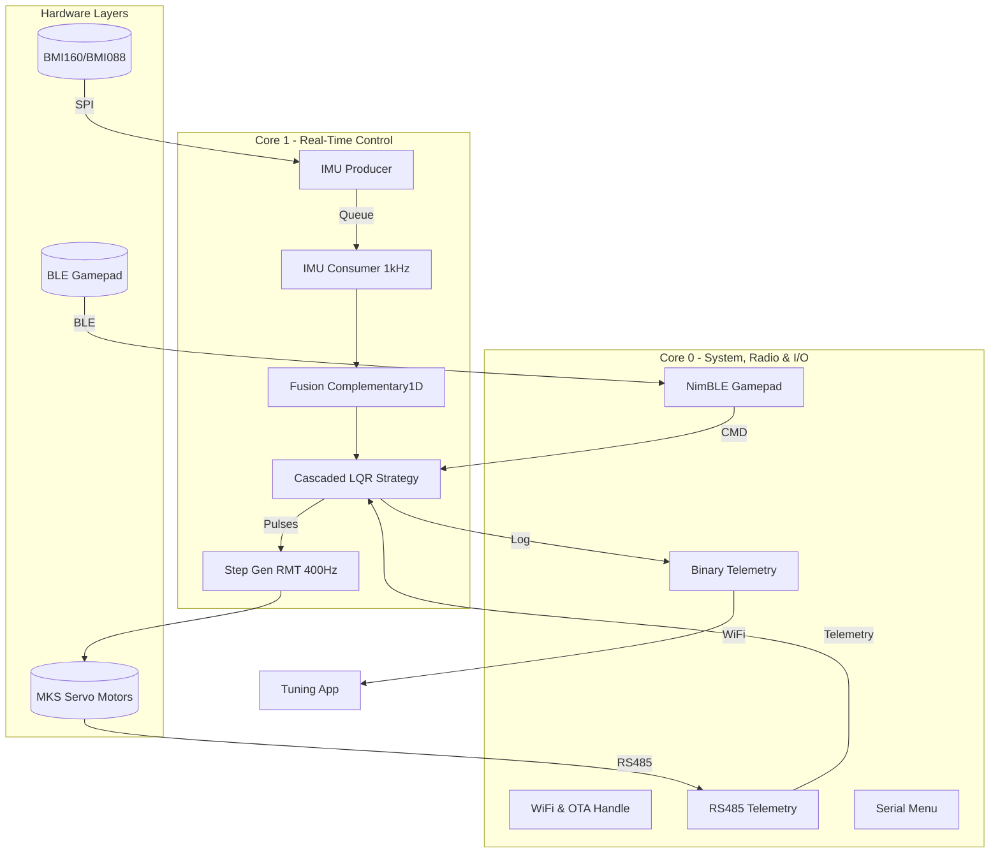

# Architecture & Dual-Core Task Mapping

This document describes how tasks are distributed between the two cores of the ESP32-S3 to ensure deterministic control.

## Dual-Core Architecture

The system uses a "Split-Brain" design to protect the high-speed control loop from non-deterministic delays.

```mermaid
flowchart TD
    subgraph Core0 [Core 0 - System, Radio & I/O]
        direction TB
        WIFI[WiFi & OTA Handle]
        BLE[NimBLE Gamepad]
        MOT_TEL[RS485 Telemetry]
        TEL_SER[Binary Telemetry]
        LOG[Serial Menu]
    end

    subgraph Core1 [Core 1 - Real-Time Control]
        direction TB
        Producer[IMU Producer]
        Consumer[IMU Consumer 1kHz]
        Fusion[Fusion Complementary1D]
        LQR[Cascaded LQR Strategy]
        StepGen[Step Gen RMT 400Hz]
    end

    subgraph HW [Hardware Layers]
        IMU_HW[(BMI160/BMI088)]
        MOT_HW[(MKS Servo Motors)]
        PAD_HW[(BLE Gamepad)]
    end

    %% Interactions
    IMU_HW -- SPI --> Producer
    Producer -- Queue --> Consumer
    Consumer --> Fusion
    Fusion --> LQR
    LQR -- Pulses --> StepGen
    StepGen --> MOT_HW
    
    PAD_HW -- BLE --> BLE
    BLE -- "CMD" --> LQR
    
    MOT_HW -- RS485 --> MOT_TEL
    MOT_TEL -- "Telemetry" --> LQR
    
    LQR -- "Log" --> TEL_SER
    TEL_SER -- "WiFi" --> Remote[Tuning App]
```

## Task Priority & Core Assignment

| Core | Task Name | Priority | Role |
| :--- | :--- | :--- | :--- |
| **Core 1** | `IMUProducer` | 20 | Ultra-fast SPI reads. |
| **Core 1** | `IMUConsumer` | 10 | Control Loop (Filter+LQR). |
| **Core 0** | `WiFiConsole` | 5 | WiFi & OTA management. |
| **Core 0** | `BTLETask` | 5 | Bluetooth Gamepad client. |
| **Core 0** | `motorL_task` | 5 | RS485 Encoder reading. |
| **Core 0** | `bal_tel` | 1 | Binary telemetry streaming. |

### Why this split?
- **Core 1 (Physics)**: Dedicated 1000Hz loop. Never blocked by radio or flash.
- **Core 0 (System)**: Handles heavy stacks (Wi-Fi/BLE) and asynchronous I/O.

### Communication
1. **Downlink**: Core 0 (Gamepad) updates variables read by Core 1.
2. **Uplink**: Core 1 (LQR) fills buffers sent by Core 0 (Telemetry).
